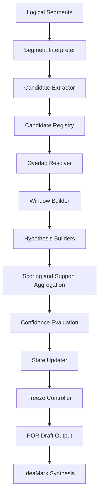
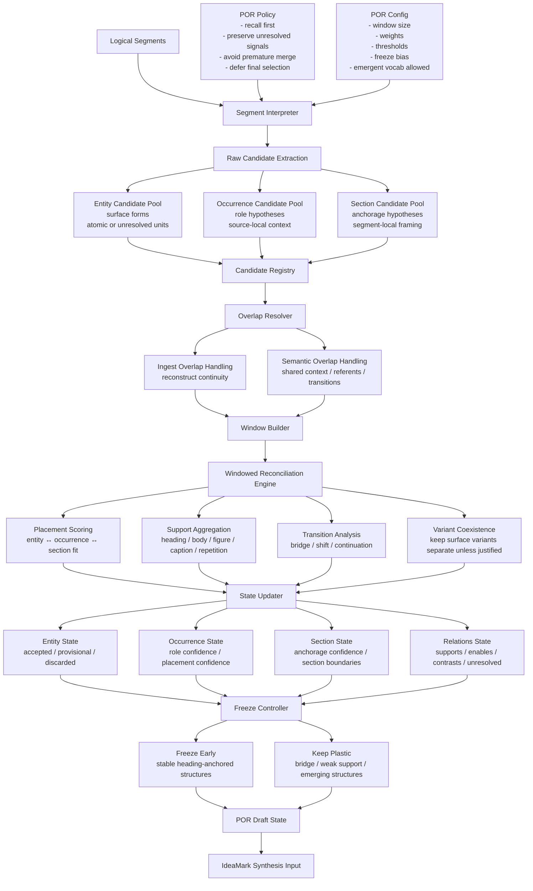
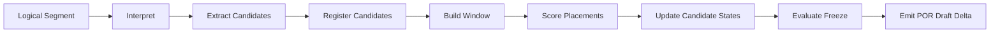

# POR Engine Internal Structure

## Development Specification v0.2

This document describes the **internal architecture of the POR (Portable
Object Reconstruction) Engine** used in the IdeaMark processing
pipeline.

The POR engine transforms **logical segments** extracted from source
material into **portable knowledge components** that can later be
synthesized into IdeaMark documents.

The design is based on several key principles:

-   Knowledge reuse requires **detaching textual meaning from its
    original document context**
-   Extracted units must remain **reusable across different contexts**
-   Structural interpretation should be **deferred and revisable**
-   Signal recall is prioritized over early precision filtering

The engine therefore maintains candidates in provisional states until
structural confidence becomes sufficient.

------------------------------------------------------------------------

# Conceptual Background

The POR approach is motivated by the idea that **knowledge reuse is
fundamentally the act of placing textual fragments into new contexts**.

Human readers and LLMs both interpret text through:

-   token sequence
-   surrounding context
-   discourse role
-   structural placement

However, once knowledge is extracted into reusable units, the **original
document structure should not constrain future reuse**.

To enable this, POR separates knowledge into three layers:

  -----------------------------------------------------------------------
  Layer                               Meaning
  ----------------------------------- -----------------------------------
  Entity                              Minimal atomic textual unit that
                                      preserves semantic meaning

  Occurrence                          The role an entity plays within a
                                      discourse context

  Section                             The contextual anchorage that gives
                                      interpretation to occurrences
  -----------------------------------------------------------------------

The **anchorage concept** is borrowed from Roland Barthes.\
Anchorage attaches interpretation to otherwise portable text fragments.

Once entities are separated from their original document structure, they
remain **portable but still interpretable** through anchorage and role
attributes.

This allows knowledge fragments to:

-   move between contexts
-   combine with fragments from other sources
-   produce new interpretations

POR therefore **optimizes for reuse rather than reconstruction**.

------------------------------------------------------------------------

# POR Engine Internal Structure
## Development Specification Draft

まず、全体像の中での POR の役割を短く言うとこうです。

入力された logical segments から、可搬な知識部品群を high-recall で抽出し、window 単位で再配置・再評価し、IdeaMark 化に渡せる draft state を形成する。

------------------------------------------------------------------------

# この図の読み方

この図の中心は 4 つです。

### 1. Raw Candidate Extraction

ここではまだ「正しい意味」を決めません。
logical segment から、

* Entity 候補
* Occurrence 候補
* Section 候補

を **高再現率で広めに拾う**段階です。

ここで大事なのは、あなたの言う

> 分解できなければそのまま entity として保存を試みる

という方針です。
なので Entity Candidate Pool には、きれいに atomic に分解できたものだけでなく、

* 未分解の複合語
* 意味は強そうだが型不明の語句
* 新規語彙
* 他言語の固まり

も provisional に入ります。

---

### 2. Overlap Resolver

PORの処理体系には 2 種類の overlap があります。

* **Ingest overlap**
  分割入力の接続や復元のため
* **Semantic overlap**
  前後 segment にまたがる意味の継続のため

Ingest overlapはLogical Segmentを作る前段階で扱われ、Semantic overlapはLogical Segmentが持っているものでこのOverlap Resolverで使われます。

---

### 3. Windowed Reconciliation Engine

ここが POR の心臓部です。

ここでは、candidate を「単独で正しいか」ではなく、

* どの Section anchorage に乗るか
* どの Occurrence role を持てるか
* どんな support を持つか
* どこで transition しているか

で評価します。

つまりここでやっているのは、**意味の完全再構築ではなく、可搬部品の文脈再配置**です。

---

### 4. Freeze Controller

POR はすぐに確定しません。
安定しているものは freeze し、橋渡し的で曖昧なものは plastic のまま残します。

たとえば

* 見出し stack に強く anchorage された section は早めに freeze
* figure-supported evidence は比較的早く freeze
* bridge 的 segment や新出語彙は長く plastic に保つ

という動きです。

これにより、再利用性を落とさずに処理できます。

---

POR engine の内部は、次の 5 つの機能層として説明できます。

## 1. Candidate Preservation Layer

役割:

* signal をなるべく落とさない
* atomic に切れなくても provisional に保持する
* 表記差を早期統合しない

これは「Entity 単体の価値は失われない」という仮説に対応します。

## 2. Context Reconstruction Layer

役割:

* overlap と window により局所文脈を回復する
* 元の全文脈を完全再現しない代わりに、再配置可能な範囲で文脈を持たせる

これは「完全再現を放棄する代わりに再利用性を取る」という選択に対応します。

## 3. Anchorage/Role Projection Layer

役割:

* Entity 候補に、どの anchorage / role が当てはまりうるかを投影する
* 元の文献上の位置づけを残しつつ、新しい配置候補も開く

これはロラン・バルト由来の anchorage の考え方に直結しています。

## 4. Reconciliation Layer

役割:

* candidate を衝突・重複・接続・支持関係の中で再評価する
* 「同じに見えるが別物」「別に見えるが束ねられる」可能性を開いたまま処理する

## 5. Portability Control Layer

役割:

* どこまで freeze し、どこを可搬のまま残すか決める
* 元の文脈継承と新しい文脈適用の両方を可能にする

---

POR is based on the hypothesis that textual knowledge can be decomposed into portable units without fully preserving the original document context, as long as each unit retains contextual traces through anchorage and role hypotheses.
The goal of POR is not perfect reconstruction of the source text, but stable extraction of reusable knowledge components that can later be reinterpreted, reanchored, merged, or split under new purposes.

---

# 実装視点で、POR engine の入出力を整理すると

## 入力

* logical segments
* ingest overlap relations
* semantic overlap hints
* por-policy
* por-config

## 中間状態

* entity candidate registry
* occurrence candidate registry
* section candidate registry
* relation hypotheses
* confidence axes
* freeze state

## 出力

* POR draft state
* accepted / provisional / discarded
* synthesis-ready candidates

ここで重要なのは、**POR 出力は最終 IdeaMark ではない**ことです。
これは今までの整理とも一致しています。

---

# さらに一段、実装単位に寄せた図

もしエンジン実装に寄せるなら、もう少し機械寄りにこうも描けます。

この図は、ストリーミング処理にも向いています。
segment ごとに delta を積み上げていく形です。

------------------------------------------------------------------------

# Module Overview

| Module                          | Responsibility                                            | Main Input                                              | Main Output                          | Execution Style                | Controlled By             |
| ------------------------------- | --------------------------------------------------------- | ------------------------------------------------------- | ------------------------------------ | ------------------------------ | ------------------------- |
| `segment_interpreter`           | logical segment を読み、候補抽出用の局所解釈を作る                         | logical segment, local context hint                     | interpreted segment, extraction cues | model-assisted                 | por-policy, por-config    |
| `candidate_extractor`           | Entity / Occurrence / Section の候補を高再現率で抽出する               | interpreted segment                                     | raw candidate list                   | model-assisted                 | por-policy                |
| `candidate_normalizer`          | candidate に ID を振り、surface form・span・source segment を整形する | raw candidate list                                      | normalized candidates                | deterministic                  | por-config                |
| `candidate_registry`            | 抽出済み candidate を一元管理し、履歴と provenance を保持する                | normalized candidates                                   | candidate registry state             | deterministic                  | fixed core behavior       |
| `overlap_resolver`              | ingest overlap / semantic overlap を整理し、接続・共有文脈を推定する       | segment sequence, overlap hints                         | overlap relations                    | deterministic                  | ingest-config, por-config |
| `window_builder`                | segment 群から reconciliation 用の window を作る                  | logical segments, overlap relations                     | windows                              | deterministic                  | por-config                |
| `section_hypothesis_builder`    | section anchorage 候補を生成・更新する                              | candidates, windows, heading cues                       | section hypotheses                   | hybrid                         | por-policy, por-config    |
| `occurrence_hypothesis_builder` | Occurrence role 候補を生成・更新する                                | candidates, windows                                     | occurrence hypotheses                | hybrid                         | por-policy, por-config    |
| `entity_state_builder`          | Entity 候補の状態を更新する。未分解でも provisional に保持する                 | candidates, windows                                     | entity state                         | deterministic with model hints | por-policy                |
| `placement_scorer`              | entity-occurrence-section の適合度を採点する                       | entity state, occurrence hypotheses, section hypotheses | placement scores                     | deterministic                  | por-config                |
| `support_aggregator`            | heading / body / figure / caption / repetition などの支持を集約する | candidate registry, segment metadata                    | support scores                       | deterministic                  | por-config                |
| `transition_analyzer`           | bridge, shift, continuation などの遷移を判定する                    | ordered windows, hypotheses                             | transition signals                   | hybrid                         | por-policy, por-config    |
| `variant_tracker`               | 表記揺れや近縁候補を早期統合せず追跡する                                      | candidate registry                                      | variant groups                       | deterministic                  | por-policy                |
| `relation_hypothesis_builder`   | supports / enables / contrasts などの関係候補を作る                 | accepted/provisional candidates, windows                | relation hypotheses                  | hybrid                         | por-config                |
| `confidence_evaluator`          | extraction / placement / support / stability を軸別に更新する     | scores, hypotheses, support signals                     | confidence axes                      | deterministic                  | por-config                |
| `state_updater`                 | accepted / provisional / discarded の状態を更新する               | confidence axes, policy rules                           | candidate states                     | deterministic                  | por-config                |
| `freeze_controller`             | どこを freeze し、どこを plastic に保つか決める                          | candidate states, section states, transition signals    | freeze decisions                     | deterministic                  | por-config                |
| `draft_state_emitter`           | POR draft state を外部に渡せる形にまとめる                             | full POR state                                          | por_draft delta / snapshot           | deterministic                  | output contract           |
| `synthesis_adapter`             | IdeaMark synthesis に必要な形へ変換する                             | por_draft state                                         | synthesis-ready candidates           | deterministic                  | ideamark-policy, template |

  -----------------------------------------------------------------------------------------------------------------------------
  Module                          Responsibility                   Main Input    Main Output   Execution Style  Controlled By
  ------------------------------- -------------------------------- ------------- ------------- ---------------- ---------------
  segment_interpreter             Interpret logical segment and    logical       interpreted   model-assisted   por-policy,
                                  prepare extraction cues          segment       segment                        por-config

  candidate_extractor             Extract entity, occurrence and   interpreted   raw candidate model-assisted   por-policy
                                  section candidates               segment       list                           

  candidate_normalizer            Assign IDs and normalize         raw           normalized    deterministic    por-config
                                  candidate structure              candidates    candidates                     

  candidate_registry              Maintain global registry and     normalized    candidate     deterministic    engine core
                                  provenance tracking              candidates    registry                       
                                                                                 state                          

  overlap_resolver                Resolve ingest overlap and       segments      overlap       deterministic    ingest-config
                                  semantic overlap                               relations                      

  window_builder                  Build reconciliation windows     segments      windows       deterministic    por-config
                                  across segments                                                               

  section_hypothesis_builder      Generate section anchorage       candidates    section       hybrid           por-policy
                                  hypotheses                                     hypotheses                     

  occurrence_hypothesis_builder   Generate occurrence role         candidates    occurrence    hybrid           por-policy
                                  hypotheses                                     hypotheses                     

  entity_state_builder            Maintain entity state and        candidates    entity state  deterministic    por-policy
                                  unresolved candidates                                                         

  placement_scorer                Score candidate placements       hypotheses    placement     deterministic    por-config
                                                                                 scores                         

  support_aggregator              Aggregate structural support     metadata      support       deterministic    por-config
                                  signals                                        scores                         

  transition_analyzer             Detect discourse transitions     windows       transition    hybrid           por-policy
                                                                                 signals                        

  variant_tracker                 Track surface form variants      candidates    variant       deterministic    por-policy
                                                                                 groups                         

  relation_hypothesis_builder     Generate relation hypotheses     candidates    relation      hybrid           por-config
                                                                                 candidates                     

  confidence_evaluator            Evaluate candidate confidence    scores        confidence    deterministic    por-config
                                                                                 axes                           

  state_updater                   Update                           confidence    candidate     deterministic    por-config
                                  accepted/provisional/discarded                 states                         
                                  state                                                                         

  freeze_controller               Determine plastic vs frozen      candidate     freeze        deterministic    por-config
                                  structures                       states        decisions                      

  draft_state_emitter             Produce POR draft state output   engine state  POR draft     deterministic    output contract

  synthesis_adapter               Prepare data for IdeaMark        POR draft     synthesis     deterministic    ideamark
                                  synthesis                                      input                          template
  -----------------------------------------------------------------------------------------------------------------------------

------------------------------------------------------------------------

# Architectural Layers

The modules are organized into six architectural layers.

  --------------------------------------------------------------------------------
  Layer                   Purpose                 Modules
  ----------------------- ----------------------- --------------------------------
  Interpretation Layer    Extract candidate       segment_interpreter,
                          signals from segments   candidate_extractor

  Candidate Management    Preserve extracted      candidate_normalizer,
  Layer                   knowledge units         candidate_registry,
                                                  variant_tracker

  Context Reconstruction  Rebuild local context   overlap_resolver, window_builder
  Layer                   windows                 

  Hypothesis Projection   Assign provisional      section_hypothesis_builder,
  Layer                   structural              occurrence_hypothesis_builder,
                          interpretations         entity_state_builder

  Reconciliation Layer    Evaluate structural     placement_scorer,
                          support and relations   support_aggregator,
                                                  transition_analyzer,
                                                  relation_hypothesis_builder,
                                                  confidence_evaluator

  Stabilization Layer     Finalize draft          state_updater,
                          structures              freeze_controller,
                                                  draft_state_emitter,
                                                  synthesis_adapter
  --------------------------------------------------------------------------------

------------------------------------------------------------------------

# Candidate Data Structure

Each extracted candidate should contain at minimum:

  Field                   Description
  ----------------------- --------------------------------------
  candidate_id            Unique identifier
  surface_form            Original textual form
  source_segments         Segments where candidate appeared
  extraction_cues         Extraction rationale
  section_hypotheses      Possible anchorage placements
  occurrence_hypotheses   Possible role placements
  support_signals         Structural support indicators
  confidence_axes         Multi-dimensional confidence metrics
  selection_state         accepted / provisional / discarded
  freeze_state            plastic / frozen

------------------------------------------------------------------------

# Design Principles

The POR engine follows several guiding principles.

  -----------------------------------------------------------------------
  Principle                           Meaning
  ----------------------------------- -----------------------------------
  Recall-first extraction             Avoid losing signals during early
                                      processing

  Deferred interpretation             Structural meaning should emerge
                                      through evaluation

  Variant preservation                Surface variations should not be
                                      prematurely merged

  Context reconstruction              Meaning emerges from windows rather
                                      than isolated segments

  Structural plasticity               Candidates remain mutable until
                                      confidence stabilizes
  -----------------------------------------------------------------------

------------------------------------------------------------------------

# Expected Outcome

The POR engine does **not attempt to reconstruct the original
document**.

Instead it produces a **portable knowledge graph draft** that can later
be synthesized into:

-   IdeaMark documents
-   Knowledge reuse structures
-   Cross-document synthesis artifacts
