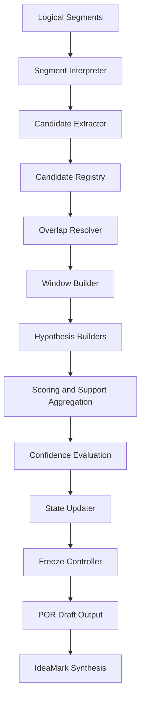
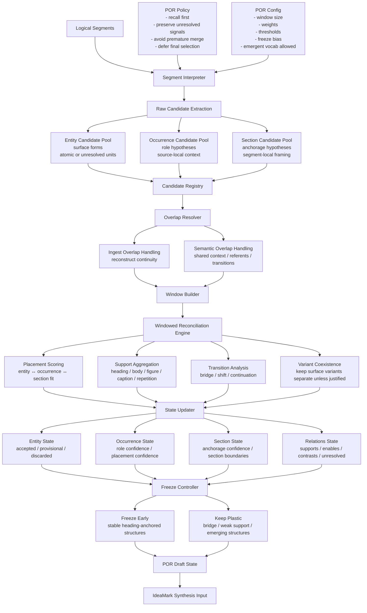

# POR Engine Internal Structure

## Development Specification v0.2

This document describes the **internal architecture of the POR (Portable
Object Reconstruction) Engine** used in the IdeaMark processing
pipeline.

The POR engine transforms **logical segments** extracted from source
material into **portable knowledge components** that can later be
synthesized into IdeaMark documents.

The design is based on several key principles:

-   Knowledge reuse requires **detaching textual meaning from its
    original document context**
-   Extracted units must remain **reusable across different contexts**
-   Structural interpretation should be **deferred and revisable**
-   Signal recall is prioritized over early precision filtering

The engine therefore maintains candidates in provisional states until
structural confidence becomes sufficient.

------------------------------------------------------------------------

# Conceptual Background

The POR approach is motivated by the idea that **knowledge reuse is
fundamentally the act of placing textual fragments into new contexts**.

Human readers and LLMs both interpret text through:

-   token sequence
-   surrounding context
-   discourse role
-   structural placement

However, once knowledge is extracted into reusable units, the **original
document structure should not constrain future reuse**.

To enable this, POR separates knowledge into three layers:

  -----------------------------------------------------------------------
  Layer                               Meaning
  ----------------------------------- -----------------------------------
  Entity                              Minimal atomic textual unit that
                                      preserves semantic meaning

  Occurrence                          The role an entity plays within a
                                      discourse context

  Section                             The contextual anchorage that gives
                                      interpretation to occurrences
  -----------------------------------------------------------------------

The **anchorage concept** is borrowed from Roland Barthes.\
Anchorage attaches interpretation to otherwise portable text fragments.

Once entities are separated from their original document structure, they
remain **portable but still interpretable** through anchorage and role
attributes.

This allows knowledge fragments to:

-   move between contexts
-   combine with fragments from other sources
-   produce new interpretations

POR therefore **optimizes for reuse rather than reconstruction**.

------------------------------------------------------------------------

# POR Engine Pipeline Overview

------------------------------------------------------------------------

# How to Read the Pipeline

The pipeline is **not strictly linear processing**.

Instead it behaves like an **iterative hypothesis stabilization
system**:

1.  Extract candidates with high recall
2.  Maintain all candidates in a registry
3.  Reconstruct local context windows
4.  Generate structural hypotheses
5.  Evaluate support signals
6.  Update candidate states
7.  Freeze stable structures
8.  Emit draft representation

This allows POR to:

-   tolerate ambiguous inputs
-   delay structural decisions
-   preserve signals for later reinterpretation

------------------------------------------------------------------------

# Module Overview

  -----------------------------------------------------------------------------------------------------------------------------
  Module                          Responsibility                   Main Input    Main Output   Execution Style  Controlled By
  ------------------------------- -------------------------------- ------------- ------------- ---------------- ---------------
  segment_interpreter             Interpret logical segment and    logical       interpreted   model-assisted   por-policy,
                                  prepare extraction cues          segment       segment                        por-config

  candidate_extractor             Extract entity, occurrence and   interpreted   raw candidate model-assisted   por-policy
                                  section candidates               segment       list                           

  candidate_normalizer            Assign IDs and normalize         raw           normalized    deterministic    por-config
                                  candidate structure              candidates    candidates                     

  candidate_registry              Maintain global registry and     normalized    candidate     deterministic    engine core
                                  provenance tracking              candidates    registry                       
                                                                                 state                          

  overlap_resolver                Resolve ingest overlap and       segments      overlap       deterministic    ingest-config
                                  semantic overlap                               relations                      

  window_builder                  Build reconciliation windows     segments      windows       deterministic    por-config
                                  across segments                                                               

  section_hypothesis_builder      Generate section anchorage       candidates    section       hybrid           por-policy
                                  hypotheses                                     hypotheses                     

  occurrence_hypothesis_builder   Generate occurrence role         candidates    occurrence    hybrid           por-policy
                                  hypotheses                                     hypotheses                     

  entity_state_builder            Maintain entity state and        candidates    entity state  deterministic    por-policy
                                  unresolved candidates                                                         

  placement_scorer                Score candidate placements       hypotheses    placement     deterministic    por-config
                                                                                 scores                         

  support_aggregator              Aggregate structural support     metadata      support       deterministic    por-config
                                  signals                                        scores                         

  transition_analyzer             Detect discourse transitions     windows       transition    hybrid           por-policy
                                                                                 signals                        

  variant_tracker                 Track surface form variants      candidates    variant       deterministic    por-policy
                                                                                 groups                         

  relation_hypothesis_builder     Generate relation hypotheses     candidates    relation      hybrid           por-config
                                                                                 candidates                     

  confidence_evaluator            Evaluate candidate confidence    scores        confidence    deterministic    por-config
                                                                                 axes                           

  state_updater                   Update                           confidence    candidate     deterministic    por-config
                                  accepted/provisional/discarded                 states                         
                                  state                                                                         

  freeze_controller               Determine plastic vs frozen      candidate     freeze        deterministic    por-config
                                  structures                       states        decisions                      

  draft_state_emitter             Produce POR draft state output   engine state  POR draft     deterministic    output contract

  synthesis_adapter               Prepare data for IdeaMark        POR draft     synthesis     deterministic    ideamark
                                  synthesis                                      input                          template
  -----------------------------------------------------------------------------------------------------------------------------

------------------------------------------------------------------------

# Architectural Layers

The modules are organized into six architectural layers.

  --------------------------------------------------------------------------------
  Layer                   Purpose                 Modules
  ----------------------- ----------------------- --------------------------------
  Interpretation Layer    Extract candidate       segment_interpreter,
                          signals from segments   candidate_extractor

  Candidate Management    Preserve extracted      candidate_normalizer,
  Layer                   knowledge units         candidate_registry,
                                                  variant_tracker

  Context Reconstruction  Rebuild local context   overlap_resolver, window_builder
  Layer                   windows                 

  Hypothesis Projection   Assign provisional      section_hypothesis_builder,
  Layer                   structural              occurrence_hypothesis_builder,
                          interpretations         entity_state_builder

  Reconciliation Layer    Evaluate structural     placement_scorer,
                          support and relations   support_aggregator,
                                                  transition_analyzer,
                                                  relation_hypothesis_builder,
                                                  confidence_evaluator

  Stabilization Layer     Finalize draft          state_updater,
                          structures              freeze_controller,
                                                  draft_state_emitter,
                                                  synthesis_adapter
  --------------------------------------------------------------------------------

------------------------------------------------------------------------

# Candidate Data Structure

Each extracted candidate should contain at minimum:

  Field                   Description
  ----------------------- --------------------------------------
  candidate_id            Unique identifier
  surface_form            Original textual form
  source_segments         Segments where candidate appeared
  extraction_cues         Extraction rationale
  section_hypotheses      Possible anchorage placements
  occurrence_hypotheses   Possible role placements
  support_signals         Structural support indicators
  confidence_axes         Multi-dimensional confidence metrics
  selection_state         accepted / provisional / discarded
  freeze_state            plastic / frozen

------------------------------------------------------------------------

# Design Principles

The POR engine follows several guiding principles.

  -----------------------------------------------------------------------
  Principle                           Meaning
  ----------------------------------- -----------------------------------
  Recall-first extraction             Avoid losing signals during early
                                      processing

  Deferred interpretation             Structural meaning should emerge
                                      through evaluation

  Variant preservation                Surface variations should not be
                                      prematurely merged

  Context reconstruction              Meaning emerges from windows rather
                                      than isolated segments

  Structural plasticity               Candidates remain mutable until
                                      confidence stabilizes
  -----------------------------------------------------------------------

------------------------------------------------------------------------

# Expected Outcome

The POR engine does **not attempt to reconstruct the original
document**.

Instead it produces a **portable knowledge graph draft** that can later
be synthesized into:

-   IdeaMark documents
-   Knowledge reuse structures
-   Cross-document synthesis artifacts
