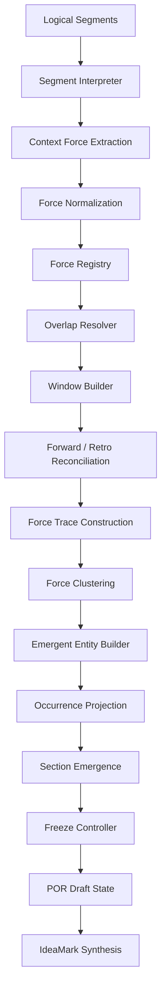

# POR Engine Internal Structure

## Development Specification v0.3

This document describes the **internal architecture of the POR (Progressive Occurrence Resolution) Engine**
used in the IdeaMark processing pipeline.

The POR engine transforms **logical segments** extracted from source material into
**portable interpretive candidates** that can later be synthesized into IdeaMark documents.

The design is based on several key principles:

- Knowledge reuse requires **detaching interpretation from the original document layout**
- Structural interpretation should be **deferred, revisable, and traceable**
- Signal recall is prioritized over early precision filtering
- Meaning should emerge through **contextual force stabilization**, not single-shot extraction
- Final IdeaMark structures are **synthesized after reconciliation**, not assumed at ingest time

The engine therefore maintains provisional candidates until structural confidence becomes sufficient.

------------------------------------------------------------------------

# Conceptual Background

The POR approach is motivated by the idea that **knowledge reuse is fundamentally the act of placing fragments into new contexts**.

Human readers and LLMs both interpret input through:

- sequence
- surrounding context
- discourse function
- structural placement
- retrospective reinterpretation

However, once knowledge is extracted into reusable units, the **original document structure should not rigidly constrain future reuse**.

To enable this, POR separates processing into the following conceptual layers:

| Layer | Meaning |
|------|---------|
| Fragment | Local input unit handled by POR processing; not necessarily a word, sentence, or stable semantic unit |
| Context Force | A hypothesis about how a fragment acts upon the current context |
| Force Trace | A local chain of context-force hypotheses across a window |
| Force Cluster | A reconciled bundle of related force traces across overlaps and windows |
| Emergent Entity | A portable candidate that becomes visible after force stabilization |
| Occurrence Projection | A provisional projection of how an emergent entity may function in final structure |
| Section Emergence | A provisional contextual anchoring that stabilizes interpretation |

The anchorage concept remains important, but in POR it is reached **after**
context-force reconciliation, not assumed at first extraction.

POR therefore optimizes for **reuse and reinterpretation rather than reconstruction**.

------------------------------------------------------------------------

# Key Distinction: context_force vs occurrence_role

A crucial distinction in POR is:

- **context_force** is an internal POR hypothesis about how a fragment acts on the current context
- **occurrence_role** is a final IdeaMark structural role assigned after synthesis

These MUST NOT be conflated.

A context_force may later contribute to an occurrence_role,
but it is not itself an occurrence_role.

------------------------------------------------------------------------

# Overall Pipeline

In short, POR does the following:

> From logical segments, extract context-force hypotheses with high recall,
> reconcile them across overlaps and windows,
> allow both forward and backward reinterpretation,
> and only then let Entity / Occurrence / Section candidates emerge.

------------------------------------------------------------------------

# Reading the Pipeline

## 1. Context Force Extraction

At this stage POR does **not** decide final meaning.

Instead, it asks:

> Within the current window, how does a later fragment act on the earlier context?

Examples of context_force-like behavior:

- supplement
- contrast
- reinforce
- clarify
- delay
- bridge
- reframe
- negate
- foreshadow
- suspend
- silence-as-tension

This applies not only to prose text, but also to:

- chat logs
- utterance collections
- spoken interaction
- pauses / silence
- other temporally ordered expression streams

## 2. Forward and Retro Reconciliation

POR must not process only in forward order.

Some effects become visible only after later context appears:

- conclusion-first then explanation
- late reversal of prior reading
- retroactive clarification
- later revelation changing earlier role

Therefore POR includes both:

- **forward reconciliation**: later fragments acting on earlier context
- **retro reconciliation**: later context reinterpreting prior force hypotheses

Retro reinterpretation MUST add new interpretive state rather than delete historical state.

## 3. Force Trace Construction

A single context_force is rarely enough.

POR therefore builds **force traces**:
local chains of fragment-to-context actions across a window.

These traces are more stable than isolated force detections.

## 4. Force Clustering

Across overlap relations and adjacent windows, force traces are compared and bundled into **force clusters**.

This is where support, transition, repetition, and contrast signals begin to stabilize.

## 5. Entity Emergence

POR does not treat Entity as the primary extracted unit.

Instead:

> Entity emerges as a compressed, portable candidate from a stabilized force cluster.

This may later become:

- a neutral reusable entity
- a trigger-oriented entity candidate
- a provisional unresolved entity
- a split/merge candidate

## 6. Occurrence Projection and Section Emergence

Only after force stabilization do we project:

- possible occurrence_role candidates
- possible section anchorage candidates

Thus final IdeaMark structure is **post-reconciliation output**, not local extraction output.

------------------------------------------------------------------------

# Architectural Layers

## 1. Force Extraction Layer

Responsible for detecting local context_force hypotheses from logical segments.

Modules:
- segment_interpreter
- context_force_extractor
- explicit_entity_cue_extractor

Goal:
- High recall force detection
- Preserve raw fragment action signals
- Optionally extract strong explicit entity cues as a secondary path

## 2. Force Management Layer

Responsible for storing, normalizing, and tracking force hypotheses.

Modules:
- force_normalizer
- force_registry
- variant_tracker

Goal:
- Preserve provisional force-bearing fragments
- Avoid premature collapse
- Keep provenance and overlap traceability

## 3. Context Reconstruction Layer

Responsible for reconstructing local and semi-local context using overlaps and windows.

Modules:
- overlap_resolver
- window_builder

Goal:
- Recover continuity without reconstructing the full original source

## 4. Force Reconciliation Layer

Responsible for evaluating forward and retroactive contextual effects.

Modules:
- forward_reconciler
- retro_reconciler
- transition_analyzer
- support_aggregator
- confidence_evaluator

Goal:
- Compare and stabilize context_force hypotheses
- Preserve reinterpretation history

## 5. Emergence Layer

Responsible for turning stabilized force structures into reusable structural candidates.

Modules:
- force_trace_builder
- force_cluster_builder
- emergent_entity_builder
- occurrence_projection_builder
- section_emergence_builder
- relation_hypothesis_builder

Goal:
- Allow Entity / Occurrence / Section candidates to emerge from force structure

## 6. Stabilization and Output Layer

Responsible for deciding freeze/plastic status and emitting draft state.

Modules:
- state_updater
- freeze_controller
- draft_state_emitter
- synthesis_adapter

Goal:
- Produce a reusable intermediate representation for IdeaMark synthesis

------------------------------------------------------------------------

# Forward / Retro Interpretation Policy

POR supports multiple layers of reinterpretation.

## Local Forward Layer
Default path.
Within a window, estimate how later fragments act on earlier context.

## Local Retro Layer
Within the same window, detect whether later fragments reframe prior force hypotheses.

Examples:
- resolves_prior
- reframes_prior
- negates_prior
- disambiguates_prior
- reveals_prior_function

## Long-Range Backward Layer
Triggered by later structural signals such as:
- explicit conclusions
- redefinitions
- “actually / in fact / ultimately / 結局 / 実は / つまり”
- narrative payoff
- late-introduced framing terms

This layer may revise earlier interpretations by **adding** new force projections.

------------------------------------------------------------------------

# Explicit Entity Cue Path

POR is primarily **context_force-first**.

However, an **explicit entity cue path** is retained as a secondary route.

Examples of useful explicit cues:
- clear headings
- strongly repeated technical terms
- named entities with stable form
- enumerated policy objects
- formally introduced concepts

Design rule:

> Explicit entity cues may accelerate candidate emergence,
> but they MUST NOT dominate reconciliation prematurely.

This keeps POR practical without reverting to naïve entity-first extraction.

------------------------------------------------------------------------

# Candidate State Model

POR candidates are not primarily “entity candidates”.
They are initially **force-bearing fragment candidates**.

Recommended minimum fields:

| Field | Description |
|------|-------------|
| fragment_id | Unique identifier |
| surface_form | Original observed form |
| source_segments | Segments where fragment appeared |
| context_force_hypotheses | Local force hypotheses |
| retro_force_hypotheses | Retroactive reinterpretation hypotheses |
| force_trace_refs | Related trace membership |
| support_signals | Heading / repetition / transition / silence / emphasis etc. |
| confidence_axes | Multi-dimensional confidence metrics |
| selection_state | accepted / provisional / discarded |
| freeze_state | plastic / frozen |

For later-stage outputs:

| Field | Description |
|------|-------------|
| emergent_entity_hypotheses | Portable entity candidates emerging from force structure |
| occurrence_projections | Candidate occurrence roles for IdeaMark synthesis |
| section_projections | Candidate anchorage/section placements |

------------------------------------------------------------------------

# Design Principles

| Principle | Meaning |
|----------|---------|
| Recall-first extraction | Do not lose signals early |
| Force-before-entity | Prefer detecting contextual action before deciding reusable unit boundaries |
| Deferred interpretation | Final structure emerges after reconciliation |
| Variant preservation | Surface variants should not be collapsed too early |
| Retroactive reinterpretation | Later context may validly alter earlier interpretation |
| Structural plasticity | Candidates remain mutable until confidence stabilizes |
| Traceability | Reinterpretation history should remain inspectable |

------------------------------------------------------------------------

# Expected Outcome

The POR engine does **not** attempt to reconstruct the original document perfectly.

Instead it produces a **portable interpretive draft** that can later be synthesized into:

- IdeaMark documents
- knowledge reuse structures
- cross-document synthesis artifacts
- trigger-oriented editorial candidates

------------------------------------------------------------------------

# Summary Statement

> POR is not an entity extraction engine.
> It is a context-force reconciliation engine whose stabilized outputs
> allow Entity / Occurrence / Section structure to emerge for IdeaMark synthesis.
