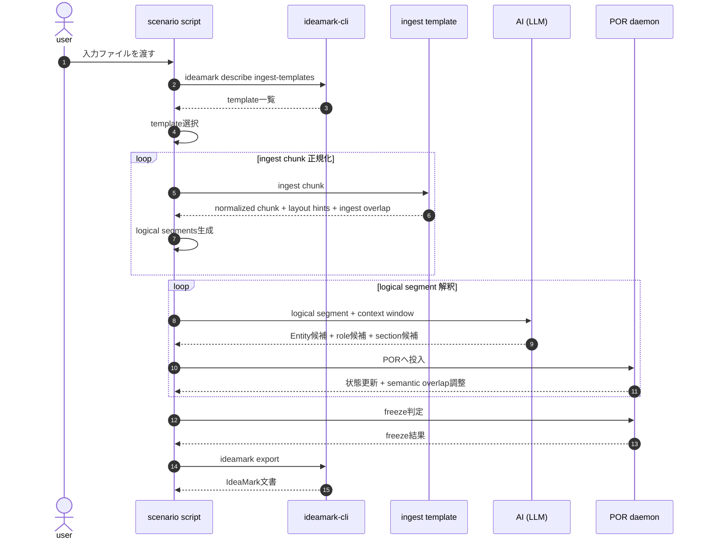

# Usecase 001: ingest template → logical segments → POR with Entity Candidate Policy

このユースケースは usecase-001 を拡張し、Entity Candidate 抽出ポリシーと
confidence による最終選別を含む POR 処理フローを示す。

目的:
- ingest template を適用して入力を logical segments に正規化
- logical segment 単位で Entity candidate を高再現率で抽出
- windowed reconciliation により構造への配置を試行
- confidence に基づいて最終採否を決定

想定:
- 入力は PDF / スクリーンショット / 長文テキスト / 議論ログなど
- ingest template は入力正規化のみを担当する
- semantic interpretation は POR が担当する

---

## 処理フロー

---

# Entity Candidate Extraction Policy (Experimental)

logical segment 処理では **Entity candidate を高再現率で抽出する**。

方針:

- 表記差は初期段階では統合しない
- 類似語も別 candidate として保持する
- 早期の意味確定を避ける

例:

自助
共助
自助・共助
防災意識
阪神・淡路大震災
救助主体
家具固定
備蓄

---

# Entity 抽出の基本条件

candidate として抽出する最低条件:

- 名詞句または概念語
- 文脈中で意味主体になり得る語
- 見出し・図表・本文に出現
- 機能語ではない

---

# Windowed Reconciliation

POR は logical segment 単体ではなく **window** で解釈する。

window では以下を評価する:

- Section anchorage への適合
- Occurrence role の可能性
- 他 candidate との関係
- evidence / context / claim / mechanism の位置

---

# Confidence Axes

candidate 評価は単一スコアではなく複数軸で行う。

### extraction_confidence
Entity candidate として抽出する妥当性

### placement_confidence
Section / Occurrence に配置できる確からしさ

### support_confidence
複数 segment や見出し・図表から支持されるか

### stability_confidence
window 移動後も解釈が安定しているか

---

# Entity Selection Outcome

最終段階では candidate を三段階に分類する。

accepted:
- 構造配置が安定している

provisional:
- 一部証拠が不足している

discarded:
- 文脈配置が成立しない

---

# 責務分担

ingest template:
- chunk 正規化
- layout role classification
- overlap detection

POR:
- candidate lattice 管理
- window reconciliation
- confidence 更新
- freeze 判定

LLM:
- logical segment 解釈
- candidate 抽出
- role / section 仮配置
