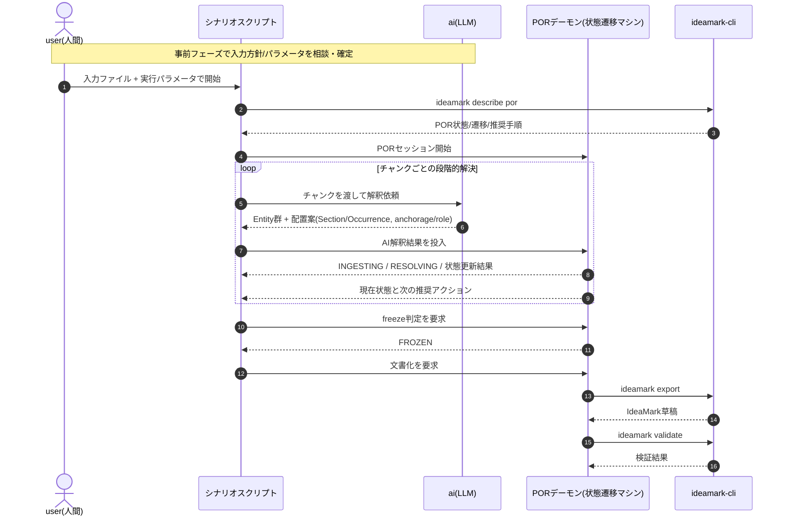

# Usecase 001: 大きなテキストからPORでIdeaMark文書を生成

```mermaid
sequenceDiagram
    autonumber
    actor U as user(人間)
    participant S as シナリオスクリプト
    participant A as ai(LLM)
    participant D as PORデーモン(状態遷移マシン)
    participant C as ideamark-cli

    Note over U,A: 事前フェーズで入力方針/パラメータを相談・確定
    U->>S: 入力ファイル + 実行パラメータで開始

    S->>C: ideamark describe por
    C-->>S: POR状態/遷移/推奨手順
    S->>D: PORセッション開始

    loop チャンクごとの段階的解決
        S->>A: チャンクを渡して解釈依頼
        A-->>S: Entity群 + 配置案(Section/Occurrence, anchorage/role)

        S->>D: AI解釈結果を投入
        D-->>S: INGESTING / RESOLVING / 状態更新結果
        D-->>S: 現在状態と次の推奨アクション
    end

    S->>D: freeze判定を要求
    D-->>S: FROZEN

    S->>D: 文書化を要求
    D->>C: ideamark export
    C-->>D: IdeaMark草稿
    D->>C: ideamark validate
    C-->>D: 検証結果
```
