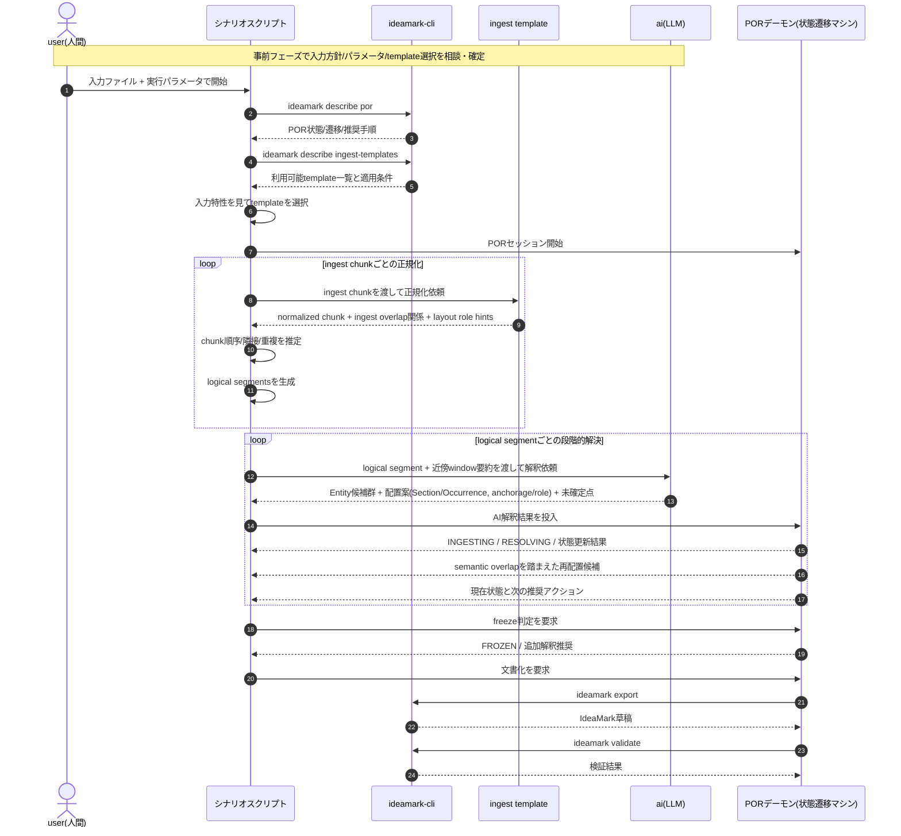

# Usecase 001: ingest templateを適用してlogical segments経由でPORに投入しIdeaMark文書を生成

このユースケースは、Usecase 001 を拡張し、入力ファイルをそのままPORに渡すのではなく、
まず ingest chunk として受け取り、適切な ingest template を適用して logical segments に正規化してから
POR で解釈・統合・freeze・export する流れを示す。

想定:
- 入力は PDF / スクリーンショット / 長文テキスト / ログなどであり、そのままではPORに最適化されていない
- シナリオスクリプトは入力特性に応じて ingest template を選択する
- 今回の例では `whitepaper-ingest-v0.1.template.ideamark.md` を利用する
- ingest overlap は入力復元のために使う
- semantic overlap は logical segment の意味解釈安定化のために使う

## 変更点の要約

Usecase 001 からの主な変更は次の通り。

1. 入力ファイルをそのままAIへ渡すのではなく、まず ingest chunk として扱う
2. ingest template を選択して normalized chunk を得る
3. normalized chunk から logical segments を生成する
4. POR は logical segments を単位として受け取り、semantic overlap を含む window で再評価する
5. ingest overlap と semantic overlap を別概念として扱う

## このユースケースでの責務分担

### シナリオスクリプト
- 入力方針の確定
- ingest template の選択
- ingest chunk の投入順管理
- logical segment の生成と投入制御

### ingest template
- ingest chunk の正規化
- layout role classification
- noise suppression
- ingest overlap の検出
- logical segment 生成のためのヒント付与

### AI(LLM)
- logical segment 単位の解釈
- Entity候補 / Occurrence候補 / Section候補の抽出
- anchorage / role の仮配置
- 未確定点や再解釈必要点の明示

### PORデーモン
- 状態管理
- semantic overlap を踏まえた candidate の統合
- windowed reconciliation
- freeze 判定
- export 用の構造確定

## 備考

このユースケースでは、ingest template は意味確定を担当しない。
意味確定は POR 側の逐次的な再解釈と freeze の責務とする。

したがって、template の役割は
- 入力を読みやすい単位へ正規化する
- overlap と layout のヒントを与える
- POR が安定して解釈できる logical segment 列を作る

ところまでに限定される。
